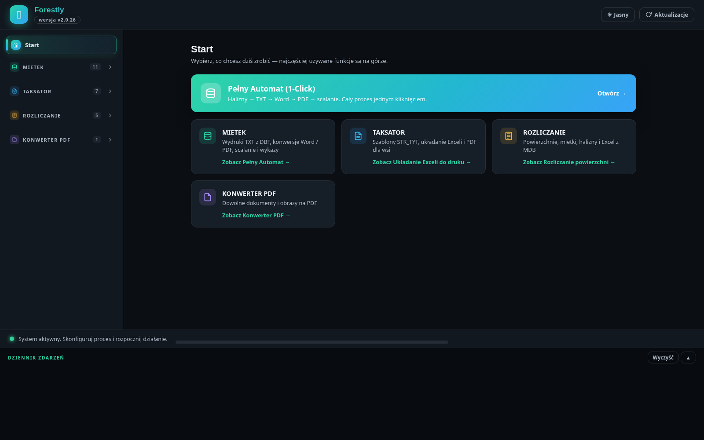
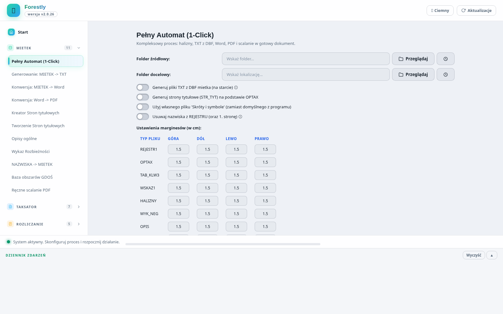
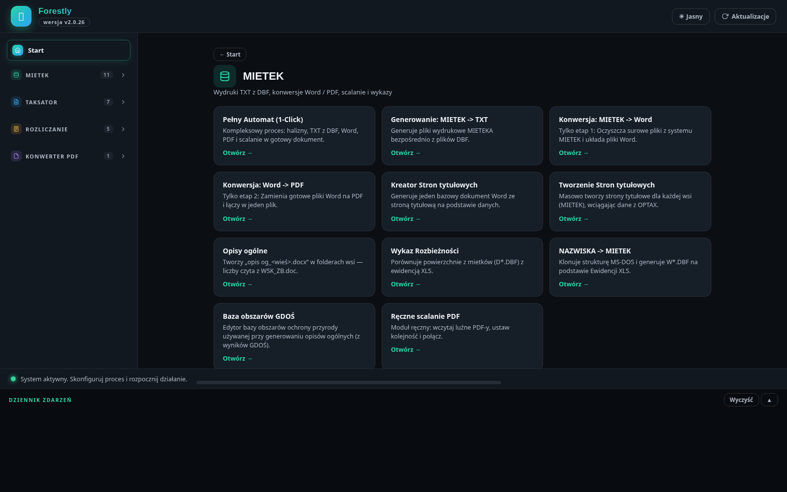
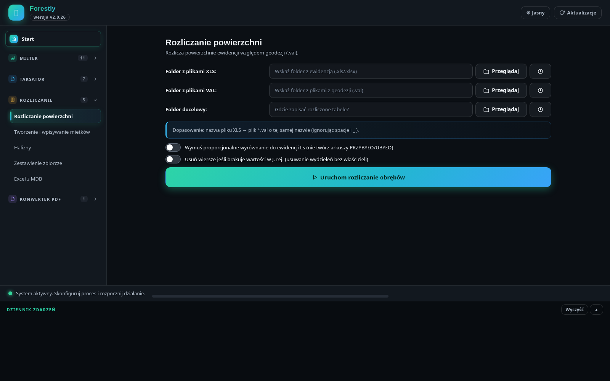
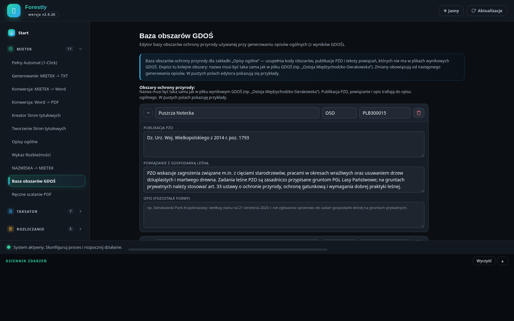

<p align="center">
  
</p>

<h1 align="center">Forestly</h1>

<p align="center">
  <b>Kombajn dokumentacji leśnej</b><br>
  Od mietków DBF po gotowy, scalony PDF — jednym kliknięciem.<br>
  <sub>Dawniej: Kombajn Leśny PRO</sub>
</p>

<p align="center">
  
  
  
  
</p>

<p align="center">
  
</p>

---

## Dlaczego Forestly?

Dokumentacja taksacyjna to godziny powtarzalnej pracy: przepisać dane z mietków,
ułożyć wydruki, poprawić halizny, złożyć wszystko w Wordzie, wydrukować PDF-y,
scalić, ponumerować… i to samo w następnym obrębie.

Forestly robi tę drogę **za Ciebie**. Wrzucasz folder z mietkami, klikasz jeden
przycisk — i po chwili dostajesz kompletny, scalony dokument gotowy do druku:
ze stroną tytułową, opisem ogólnym, tabelą klas wieku, opisami taksacyjnymi
i wszystkimi pozostałymi wydrukami w odpowiedniej kolejności.

Program jest w pełni **lokalny** — żadnych kont, chmur ani wysyłania danych
gdziekolwiek. Twoje pliki zostają na Twoim komputerze.

## Co potrafi

| | Funkcja |
|---|---|
| **1-Click** | Cały proces — halizny → TXT → Word → PDF → scalanie — jednym kliknięciem, z panelem postępu krok po kroku |
| **Wydruki MIETEKA bez MS-DOS** | Osiem plików wydrukowych (OPTAX, TAB_KLW3, REJESTR1, ZEST1, WSKAZ1…) generowanych wprost z DBF, zgodnych 1:1 z oryginałem |
| **Word i PDF masowo** | Konwersja całych folderów, konfigurowalny układ scalonego PDF (kolejność i wykluczanie dokumentów) |
| **Opisy ogólne** | Automatyczne generowanie „opis og_<wieś>.docx" z raportów Excel — dla MIETEKA i TAKSATORA, z osobnymi szablonami Word |
| **Formy ochrony przyrody** | Baza obszarów Natura 2000 i parków z kodami i powiązaniami z gospodarką leśną — dopisywana automatycznie z wyników GDOŚ, z edytorem i importem/eksportem do Excela |
| **Rozliczanie powierzchni** | Zestawienia zbiorcze z kontrolą spójności (ZESTAWIENIE_Z_MIETKOW vs ZBIORCZE) |
| **Dwa interfejsy** | Nowoczesne GUI web (zalecane) i klasyczne GUI CustomTkinter — wspólny rdzeń, te same funkcje, wspólne ustawienia |

## Zrzuty ekranu

| Pełny Automat (motyw jasny) | Kategoria MIETEK |
|:---:|:---:|
|  |  |
| **Rozliczanie powierzchni** | **Baza obszarów GDOŚ** |
|  |  |

## Jak zacząć

### Po prostu używać (Windows)

1. Pobierz najnowsze wydanie z zakładki **[Releases](https://github.com/wskakuj/FORESTLY/releases)**.
2. Rozpakuj i uruchom `Forestly.exe` — instalacja nie jest potrzebna.
3. Na ekranie Start kliknij **Pełny Automat (1-Click)** i wskaż folder z mietkami.

Program sam sprawdza aktualizacje przy starcie i dociąga nowe wersje.

### Rozwój (Python)

```bash
git clone https://github.com/wskakuj/FORESTLY.git
cd FORESTLY
pip install -r requirements.txt

python main_web.py    # nowe GUI (zalecane)
python main.py        # klasyczne GUI (CustomTkinter)
```

> **Ważne:** `main.py` **i** `main_web.py` obsługują flagę `--word-worker`
> (proces pomocniczy Word COM, uruchamiany wewnętrznie przez oba GUI — także
> z wnętrza EXE, gdzie workerem jest sam plik `Forestly.exe`).
> Nie usuwać tego trybu — odpowiada za etap Word w Pełnym Automacie.

## Moduły

Program zorganizowany jest w cztery kategorie dostępne z ekranu Start:

### MIETEK — pełny cykl wydruków
Halizny, generowanie plików TXT z DBF mietka, konwersja do Word i PDF,
**Pełny Automat (1-Click)**, strony tytułowe, opisy ogólne, baza obszarów GDOŚ,
wykaz rozbieżności, nazwiska → MIETEK, ręczne scalanie PDF.

### TAKSATOR — dokumentacja taksacyjna
Tworzenie mietków, układanie Exceli, rozliczanie powierzchni, wpisywanie
krzyżówek, opisy ogólne z raportów Excel (osobny szablon), strony tytułowe
z danych STR_TYT.

### ROZLICZANIE
Rozliczanie powierzchni i zestawienia zbiorcze, Excel z MDB,
usuwanie zer z MDB.

### KONWERTER PDF
Konwerter PDF, scalanie z segregowaniem wsi, wykluczanie stron.

## Szczegóły techniczne

<details>
<summary><b>Dwa interfejsy, wspólny rdzeń</b></summary>

Program ma **dwa interfejsy ze wspólną logiką**:

- **Nowe GUI (web)** — `python main_web.py` — nowoczesny interfejs HTML/CSS/JS
  w oknie aplikacji (PyWebView + WebView2, preinstalowany na Windows 10/11).
  Ekran Start z kartami kategorii, strony przeglądowe kategorii, zwijane grupy
  w menu, motyw ciemny/jasny, dziennik zdarzeń, dashboard kroków 1-Click.
- **Klasyczne GUI (CustomTkinter)** — `python main.py` — pełny fallback
  z całą funkcjonalnością.

Oba GUI **współdzielą ustawienia** (`settings.json`, `margins_config.json`,
`folder_history.json`) — można ich używać zamiennie. Logika zakładek żyje
w mixinach (`app/gui/tabs/*.py`), z których dziedziczą zarówno klasyczne GUI,
jak i backend webowy — funkcjonalność jest 1:1.

</details>

<details>
<summary><b>Wydruki MIETEKA bez MS-DOS</b></summary>

Zakładka „Generowanie: MIETEK -> TXT" generuje pliki wydrukowe MIETEKA wprost
z plików DBF mietka (format 1:1 z oryginałem: cp852, CRLF, ramki, sekwencje PCL,
paginacja):

* **HALIZNY.TXT** — zestawienie powierzchni niezalesionych (uruchom **przed**
  przeniesieniem halizn w zakładce „Halizny");
* **OPTAX.TXT** — opis lasów i gruntów przeznaczonych do zalesienia;
* **TAB_KLW3.TXT** — zestawienie wg klas i podklas wieku + siedliska, ochronność,
  przebudowa (numeracja stron kontynuuje OPTAX);
* **ZEST1.TXT** — skorowidz działek;
* **REJESTR1.TXT** — rejestr działek wg właścicieli;
* **WSKAZ1.TXT** — wskazówki gospodarki leśnej (wykaz wskaźników);
* **WYK_NEG.TXT** — drzewostany negatywne i źle produkujące;
* **WSK_ZB.TXT** — zestawienie czynności gospodarczych (wskaźniki zbiorcze).

Pozostałe wydruki generuj **po** przeniesieniu halizn. Wzorce odtworzone i
zweryfikowane bajt-po-bajcie na oryginalnych wydrukach MIETEKA (m.in. obręby
CHORZEWO i WOL.001); znane rozbieżności: ZEST1/REJESTR1 w niektórych obrębach
(JAŹWIE) to przybliżenia — kolejność wierszy odtwarzana heurystycznie, bo
sortowanie wg indeksów NTX nie jest w pełni odtwarzalne bez silnika MS-DOS.

</details>

<details>
<summary><b>Układ scalanego PDF</b></summary>

- Domyślna kolejność szablonów: `PDF_ORDER_TEMPLATES` w `app/config.py`
  (Strona tytułowa, Opis ogólny, Tabela klas wieku, Opis taksacyjny,
  Wskazówki zbiorcze, Wykaz negatywny, Halizny, Wskazówki gospodarki leśnej,
  Rejestr, Skorowidz działek, Wykaz zmian, Skróty i symbole).
- „Skonfiguruj układ PDF" (Pełny Automat i Konwersja Word → PDF): zmiana
  kolejności strzałkami oraz **wykluczanie** pozycji (kosz/przywróć).
  Ustawienia zapisywane per folder docelowy (`<docelowy>\PDF`), wspólne
  dla obu GUI i respektowane przy scalaniu.
- Pliki niepasujące do szablonów trafiają na koniec scalonego dokumentu.

</details>

<details>
<summary><b>Struktura projektu</b></summary>

```
FORESTLY/
├── main.py                      # Klasyczne GUI (CTk) + tryb --word-worker
├── main_web.py                  # Nowe GUI (PyWebView) — punkt wejścia
├── webapp/                      # Interfejs nowego GUI
│   ├── index.html               # Szkielet strony
│   ├── style.css                # Wygląd (motywy ciemny/jasny)
│   └── app.js                   # Logika frontendu (most pywebview)
├── app/
│   ├── config.py                # Stałe, wersja, sekwencje PCL, PDF_ORDER_TEMPLATES
│   ├── models.py                # Dataclasses (OrderStore, TerritoryEntry, etc.)
│   ├── updater.py               # Aktualizacja z GitHub (UpdaterMixin)
│   ├── gui/
│   │   ├── main_window.py       # ModernApp — shell klasycznego GUI + mixins
│   │   ├── web_schema.py        # Opis zakładek/kontrolek nowego GUI (1 źródło prawdy)
│   │   ├── web_backend.py       # WebBackend — te same mixiny, most pywebview
│   │   ├── tabs/                # Każda zakładka jako osobny mixin (wspólna logika)
│   │   └── widgets/             # Okna modalne i pomocnicze (CTk)
│   └── core/                    # Logika biznesowa (bez UI)
│       ├── word_worker.py       # Proces Word COM
│       ├── wydruki.py           # Wydruki MIETEK z DBF (8 typów plików)
│       └── excel_tasks.py       # Zadania Excel
├── config/
│   └── territory.json           # Dane województw/powiatów/gmin
├── docs/images/                 # Zrzuty ekranu do README
├── tests/
├── requirements.txt
└── README.md
```

Pliki `settings.json`, `margins_config.json`, `folder_history.json` powstają
w czasie działania (zapamiętane ścieżki, marginesy, historia folderów).

</details>

---

<p align="center">
  <sub>Forestly — rozwijany z myślą o leśnikach i taksatorach. 🌲</sub>
</p>
